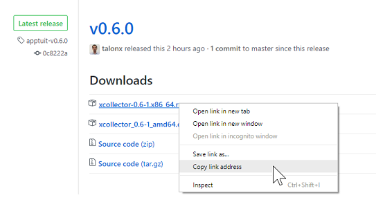

### Pre-requisites
 * An [apptuit.ai](https://apptuit.ai) account
 * Access token for your account

### For RPM based distros

 1. Download and install latest version
    * Get the download link to latest .rpm package from the [Releases Page](https://github.com/ApptuitAI/xcollector/releases)  
      
    * Download the package using the copied link  
      `wget https://github.com/ApptuitAI/xcollector/releases/download/apptuit-v0.8.0/xcollector-0.8.0-1.x86_64.rpm`
    * Install the collector  
      `yum --nogpgcheck localinstall xcollector-0.8.0-1.x86_64.rpm`
 1. Update token in the config
    * `vi /etc/xcollector/xcollector.yml`
    * Change `access_token: "PASTE_ACCESS_TOKEN_HERE"` to `access_token: "<TOKEN>"`
 1. XCollector adds a default "host" tag to all the metrics. You can add additional global tags (like environment="production" or data_center="us-east-1a" etc) to all the metrics generated on this instance. To add global tags:
    * `vi /etc/xcollector/xcollector.yml`
    * Un-comment the tags section and enable the tags relevant to your environment
 1. If you are running NGINX, verify log file format: [NGiNXAccessLog](NGiNXAccessLog)
 1. If you are running Tomcat, change your log configuration as described in: [TomcatAccessLog](TomcatAccessLog)
 1. Start the collector:  
    `service xcollector start`
 1. In case of trouble with XCollector on startup look at:  
    `service xcollector status`  
    `/var/log/boot.log `  

### For DEB based distros

1. Download and install latest version
   * Get the download link to latest .deb package from the [Releases Page](https://github.com/ApptuitAI/xcollector/releases)  
     
   * Download the package using the copied link  
     `wget https://github.com/ApptuitAI/xcollector/releases/download/apptuit-v0.8.0/xcollector_0.8.0-1_amd64.deb`
   * Install the collector  
     `sudo apt update`  
     `sudo apt install ./xcollector_0.8.0-1_amd64.deb`  
     In older versions of Ubuntu, where `apt` does not support local install, use the following sequence of commands instead  
     `sudo apt update`  
     `sudo dpkg -i ./xcollector_0.8.0-1_amd64.deb`  
     `sudo apt install -f`  
1. Update token in the config
   * `vi /etc/xcollector/xcollector.yml`
   * Change `access_token: "PASTE_ACCESS_TOKEN_HERE"` to `access_token: "<TOKEN>"`
1. XCollector adds a default "host" tag to all the metrics. You can add additional global tags (like environment="production" or data_center="us-east-1a" etc) to all the metrics generated on this instance. To add global tags:
   * `vi /etc/xcollector/xcollector.yml`
   * Un-comment the tags section and enable the tags relevant to your environment
1. If you are running NGINX, verify log file format: [NGiNXAccessLog](NGiNXAccessLog)
1. If you are running Tomcat, change your log configuration as described in: [TomcatAccessLog](TomcatAccessLog)
1. Start the collector:  
   `sudo service xcollector start`
1. In case of trouble with XCollector on startup look at:  
   `service xcollector status`  
   `/var/log/boot.log `  
